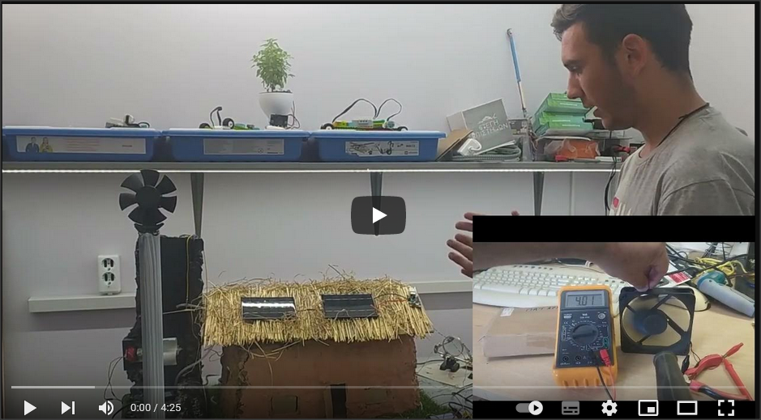

# cobitospito
Συμμετοχή στο διαγωνισμό ρομποτικής της ellak σχολικού έτους 2022 - 23
Κατηγορία Γενικού Λυκείου

**Παναγιώτης - Ανδρέας - Αλέξανδρος - Κατιάνα**  
Στέγη Επιστημών Ερμιονίδας

[][def2]

## Κατηγορίες που προσεγγίζει η εργασία μας είναι:

- Εξοικονόμηση ενέργειας
- Βελτίωση της αποδοτικότητας χρήσης πόρων μέσω της ενίσχυσης τη την αποτελεσματικής χρήσης της ενέργειας, του νερού και άλλων εισροών υλικών
- Πράσινη παραγωγή ενέργειας
- Πράσινη διαχείριση νερού
- Πράσινη κουλτούρα και κοινωνική ευαισθησία
- Αειφορία και νέες τεχνολογίες στην ενέργεια

Η κατοικία που δημιουργήσαμε κατασκευάστηκε με την τεχνική cob. Είναι μία μέθοδος δόμησης και τη βιοκλιματικής αρχιτεκτονικής, δύο πρακτικές που έχουν σαν αποτέλεσμα την εξοικονόμηση πόρων και ενέργειας, η πρώτη στην φάση της κατασκευής μιας κατοικίας ενώ η δεύτερη στην διατήρηση σταθερών συνθηκών διαβίωσης σε αυτήν. Και οι δύο καταλήγουν σε τεράστιο περιβαλλοντολογικό αλλά και οικονομικό όφελος.

Προκειμένου να κατανοήσουμε την τεχνική της κατασκευής ήρθαμε σε επαφή με τον κ. Κωνσταντίνο Κοντομάνο από την εταιρεία «Βιώσιμη Ανάπτυξη Κοιν.Σ.Επ» και μας παραχώρησε συνέντευξη εξηγώντας μας τα στάδια κατασκευής μιας κατοικίας με τη τεχνική cob.
(Ευχαριστούμε θερμά τον κ. Κωνσταντίνο Κοντομάνο)

- [Τί είναι ένα σπίτι από COB](cobHouse/README.md)
- [Εξαρτήματα - Τιμές](Εξαρτήματα/README.md)
- [Η Κατασκευή](Κατασκευή/README.md)
- [Κύκλωμα και Προγραμματισμός](Προγραμματισμός/README.md)

---

Το σύνολο του έργου μας διατείθεται με δικαιώματα:  
[Creative Commons Attribution 4.0 International License][cc-by]. 

[![CC BY 4.0][cc-by-image]][cc-by]

[cc-by]: http://creativecommons.org/licenses/by/4.0/
[cc-by-image]: https://i.creativecommons.org/l/by/4.0/88x31.png
[cc-by-shield]: https://img.shields.io/badge/License-CC%20BY%204.0-lightgrey.svg

[def1]: cobhouse/6.jpg
[def2]: https://youtu.be/yRxeDQ2eVNU