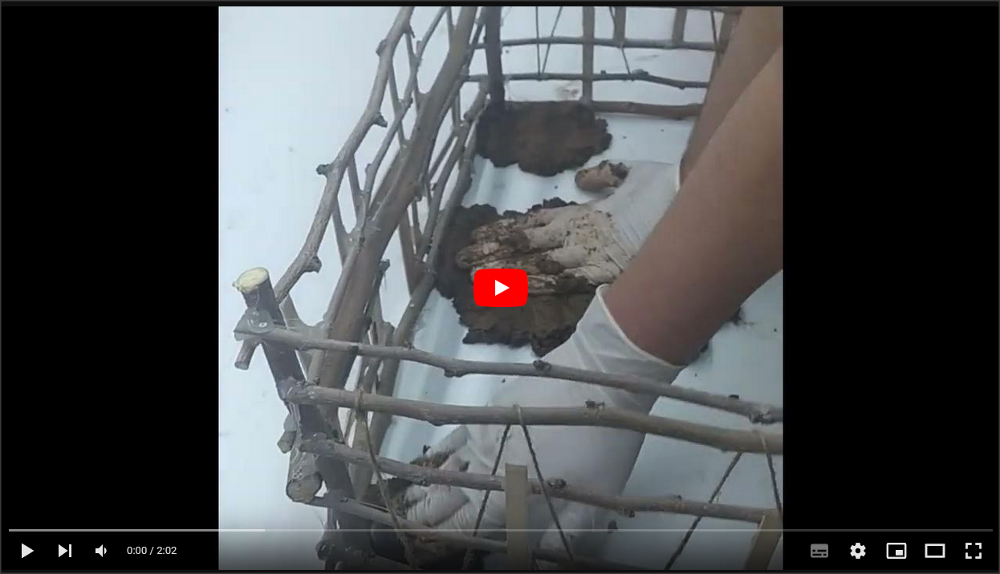
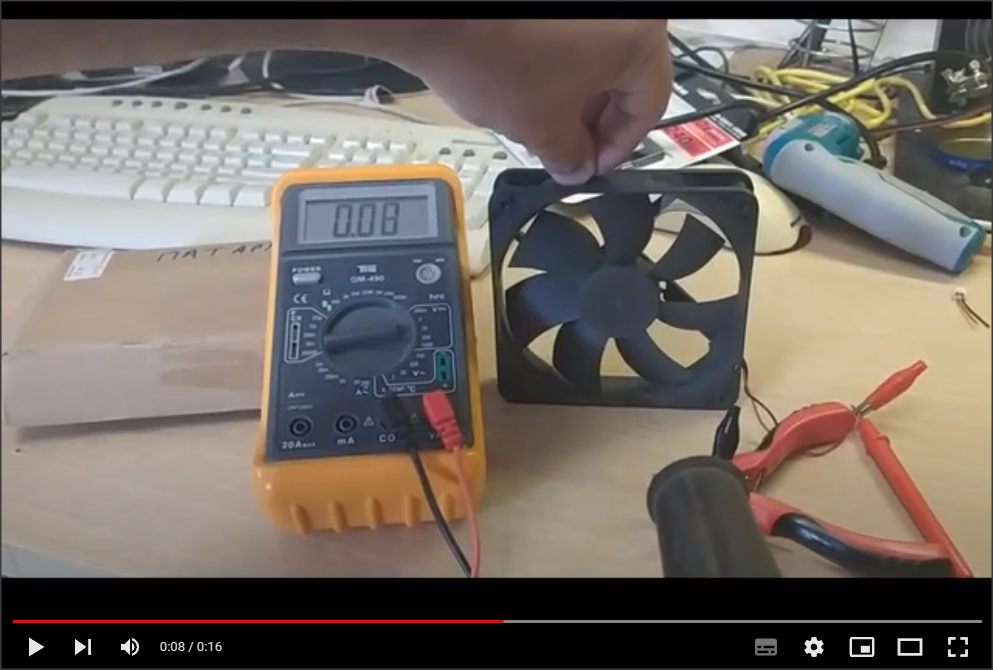

# Η κατασκευή

Η κατοικία που δημιουργήσαμε κατασκευάστηκε με την τεχνική cob. Είναι μία μέθοδος δόμησης και τη βιοκλιματικής αρχιτεκτονικής, δύο πρακτικές που έχουν σαν αποτέλεσμα την εξοικονόμηση πόρων και ενέργειας, η πρώτη στην φάση της κατασκευής μιας κατοικίας ενώ η δεύτερη στην διατήρηση σταθερών συνθηκών διαβίωσης σε αυτήν. Και οι δύο καταλήγουν σε τεράστιο περιβαλλοντολογικό αλλά και οικονομικό όφελος.

Προκειμένου να κατανοήσουμε την τεχνική της κατασκευής ήρθαμε σε επαφή με τον κ. Κωνσταντίνο Κοντομάνο από την εταιρεία «Βιώσιμη Ανάπτυξη Κοιν.Σ.Επ» και μας παραχώρησε συνέντευξη εξηγώντας μας τα στάδια κατασκευής μιας κατοικίας με τη τεχνική cob. 
(Ευχαριστούμε θερμά τον κ. Κωνσταντίνο Κοντομάνο)

### Σκελετός κατοικίας
Αρχικά κατασκευάσαμε ένα σκελετό για το κτήριο από κλαδιά μουριάς.
![photo1][def1]
![photo2][def2]
![photo3][def3]

### Πηλός
Για τον πηλό χρειαστήκαμε χώμα αργιλώδες και νερό. 
Αφαιρέσαμε όσους μεγάλους σβόλους μπορούσαμε και προσπαθήσαμε να έχουμε ένα χώμα καθαρό χωρίς πέτρες. 
![photo4][def5]
Μέσα στη λάσπη που φτιάξαμε προσθέσαμε άχυρο προκειμένου να κρατά το υλικό ενομένο και να μην σπάσει αφού στεγνώσει. 
[][def4]

(Τελικά αφού στέγνωσε δημιουργήθηκαν ρηγματώσεις και αναγκαστικά φτιάξαμε και άλλο πηλό να τις καλύψουμε... Μάλλον θα χρειαστεί στην επόμενη προσπάθεια  κάτι να κρατάει το υλικό "δεμένο"). 

### Στέγη
Η στέγη του σπιτιού δημιουργήθηκε με ξύλο μουριάς, άχυρο και λίγο ανακυκλωμένο χαρτόνι.
![photo5][def6]

4. Ανεμογεννήτρια
Η ανεμογεννήτρια είναι ένας πλαστικός σωλήνας ύδρευσης ο οποίος βιδώθηκε στην επιφάνεια του κόντρα πλακέ. 
[][def4]
Ο κινητήρας κόπηκε από όλες τις βάσεις του και έμεινε μόνο με τις φτερωτές και ένα μικρό κομμάτι το οποί στερεώθηκε πάνω στο σωλήνα με κόλλα σιλικόνης. Εσωτερικά του σωλήνα έχουμε περάσει τα καλώδια τα οποία συνδέονται στον μετατροπέα τάσης για να τροφοδοτεί σταθερά με 5V όταν περιστρέφεται. 

5. Καταρράκτης 
Ο καταρράκτης κατασκευάστηκε από σωλήνα ύδρευσης τον οποία και λυγίσαμε για να δώσουμε σχήμα. Επιπλέον τον ντύσαμε με αφρό πολυουρεθάνης για να δημιουργήσουμε τις πέτρες και στη συνέχεια το βάψαμε με μαύρο, λευκό και γκρι χρώμα.  

Ο κινητήρας μας τοποθετήθηκε εξωτερικά από τον σωλήνα σε βάση που σχεδιάσαμε στο tinkercad και στη συνέχεια κολλήθηκε ο κινητήρας ώστε να μην βρέχεται. Προσοχή θα πρέπει να δείξετε κατά την κατασκευή στην χρήση του αφρού πολυουρεθάνης επειδή μπορεί να περάσει μέσα στον κινητήρα και να δημιουργήσει προβλήματα στην περιστροφή του… κάτι που συνέβη και στην ομάδα μας. 
Η φτερωτή επίσης σχεδιάστηκε στο tinkercad και τυπώθηκε σε 3d εκτυπωτή. 

[Αρχική Σελίδα έργου][def]

[def]: https://github.com/stegiepistimwn/cobitospito
[def1]: s7.jpg
[def2]: s6.jpg
[def3]: s5.jpg
[def4]: https://youtu.be/EUUIgWW2EL8
[def5]: cob1.jpg
[def6]: 
[def7]: https://youtu.be/ZzNLaekjmFw